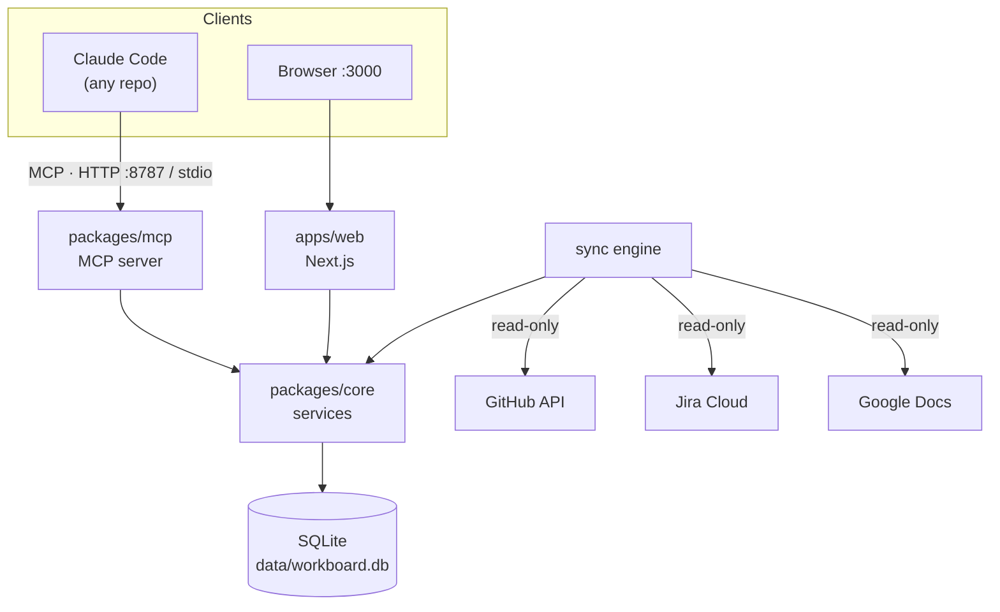
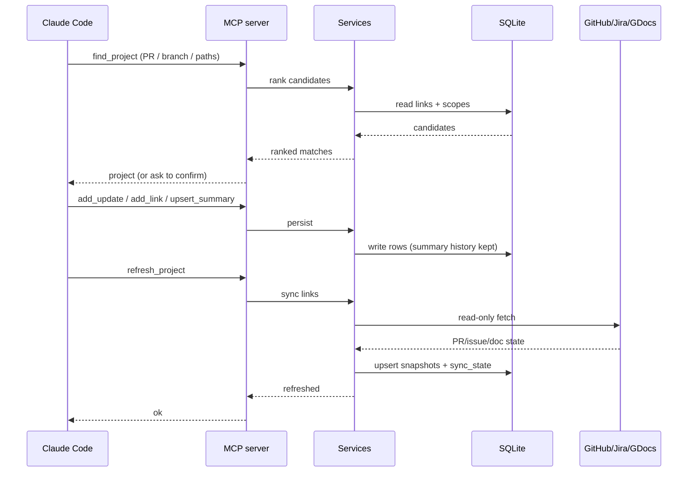
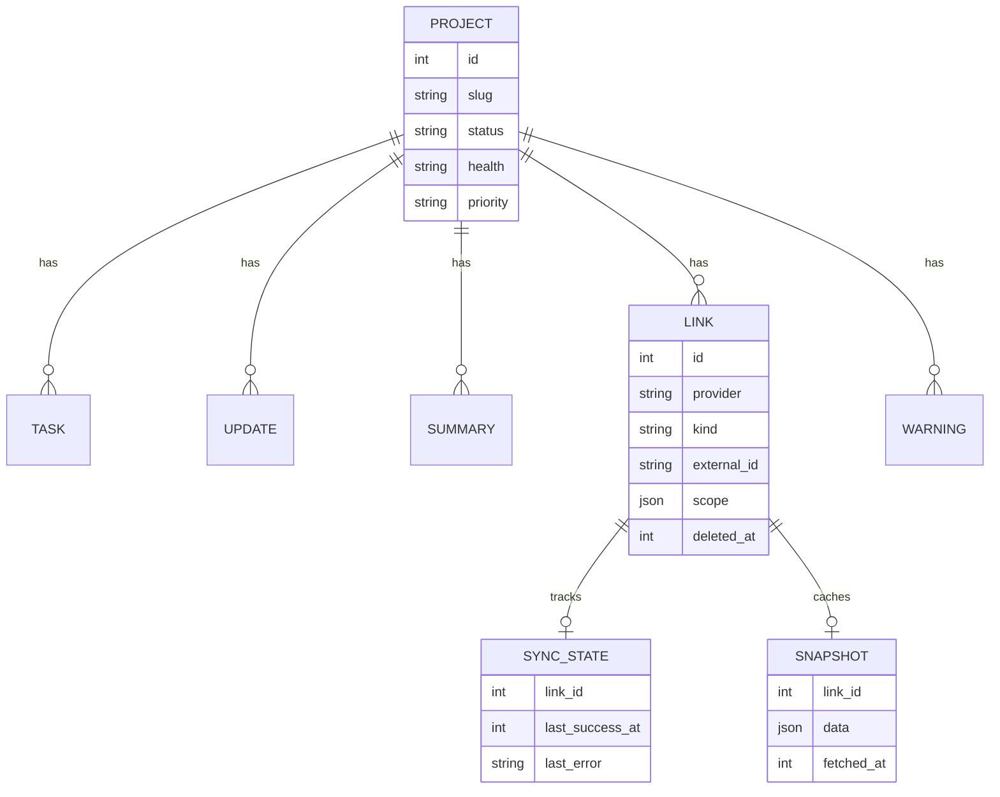

# Architecture

> System design, components, and data flow for Workboard.

## Overview

Workboard is a TypeScript monorepo (npm workspaces) built around a single SQLite
database. A Next.js App Router app renders the dashboard with server components
and server actions; a Model Context Protocol server exposes the same domain to
coding agents over streamable HTTP and stdio. Both processes share one SQLite
file. Integration clients (GitHub, Jira, Google Docs) sync external state
read-only into a snapshot table; the app and agents only ever read that cached
state. Workboard holds no LLM API key — all AI-authored content arrives through
MCP tool calls.

## Diagram

## Components

| Component | Responsibility | Location |
|-----------|---------------|----------|
| Schema | Drizzle SQLite tables + domain enums | `packages/core/src/db/schema.ts` |
| DB client | Opens SQLite, WAL, migrations | `packages/core/src/db/client.ts` |
| Services | Domain operations (projects, tasks, updates, summaries, links, warnings, reports) | `packages/core/src/services.ts` |
| Integration clients | GitHub / Jira / Google Docs read-only fetchers | `packages/core/src/integrations/{github,jira,gdrive}.ts` |
| Sync engine | Refreshes links into snapshots, records sync health | `packages/core/src/integrations/sync.ts` |
| MCP server | Tool surface over streamable HTTP + stdio | `packages/mcp/src/{http,stdio,server,tools}.ts` |
| Web app | Dashboard, project pages, reports | `apps/web/app`, `apps/web/components` |
| Server actions | Mutations from the UI | `apps/web/lib/actions.ts` |
| Skills | Claude Code skills that drive the MCP tools | `skills/` |

## MCP tool surface

The agent-facing API, defined in `packages/mcp/src/tools.ts`:

`list_projects` · `get_project` · `find_project` · `create_project` ·
`update_project` · `add_update` · `add_task` · `update_task` · `add_link` ·
`upsert_summary` · `raise_warning` · `resolve_warning` · `get_activity` ·
`save_report` · `list_reports` · `refresh_project`

## Request Flow

An agent finishing a session posts progress and refreshes the summary:

## Key Decisions

- **App writes no AI content** — Workboard has no LLM key; all summaries,
  digests, and triage come from agents via MCP. Keeps model choice and cost with
  the agent, and the app deployable anywhere.
- **Projects ≠ repos** — a monorepo hosts many projects, so a repo link never
  identifies a project. Links are individual PRs/issues or scoped repo slices
  (labels / path prefixes / branch prefix); `find_project` ranks candidates.
- **External systems stay authoritative** — integrations are strictly read-only
  and cached in `snapshots`; the UI degrades to plain links without credentials.
- **Visible sync health** — every attempt is recorded per link in `sync_state`;
  a dashboard banner surfaces failing or stale syncs, and GitHub rate limits
  trigger a cooldown rather than hammering the API.
- **Soft deletes + summary history** — deleted tasks/links keep their row
  (`deleted_at`) for restore; every `upsert_summary` is retained so the story's
  evolution is visible.

## Data Model

`projects` is the aggregate root. Tasks, updates, summaries, links, and warnings
hang off it (cascade delete). Each link has at most one `sync_state` and one
`snapshot` row holding its last fetched external state. Summaries with a null
`project_id` are cross-project digests / triage reports.

## External Dependencies

| Service | Purpose | Failure mode |
|---------|---------|--------------|
| GitHub API | PR/review/CI state, scoped PR discovery | Sync recorded as failed; last snapshot shown; rate-limit cooldown until reset |
| Jira Cloud | Issue status, per-epic/project counts | Sync recorded as failed; UI falls back to plain links |
| Google Docs | Doc titles + last-edited times | Sync recorded as failed; UI falls back to plain links |
