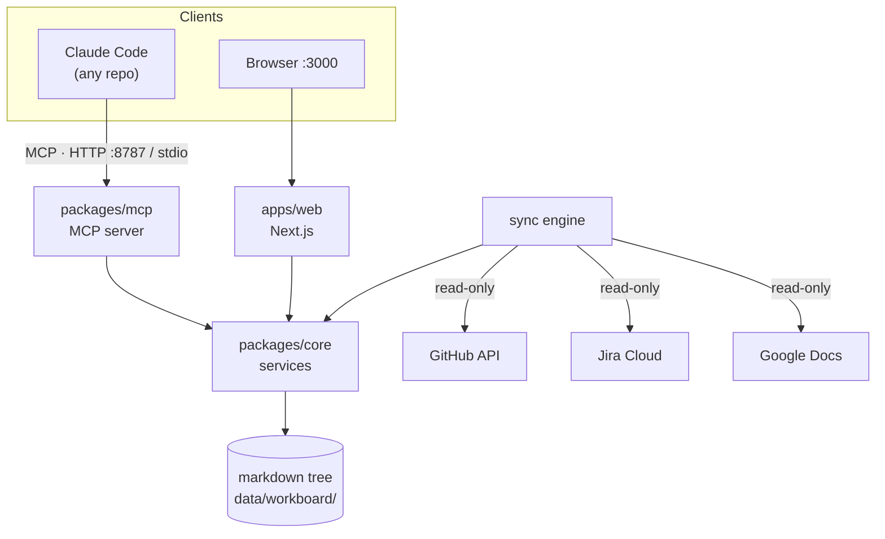
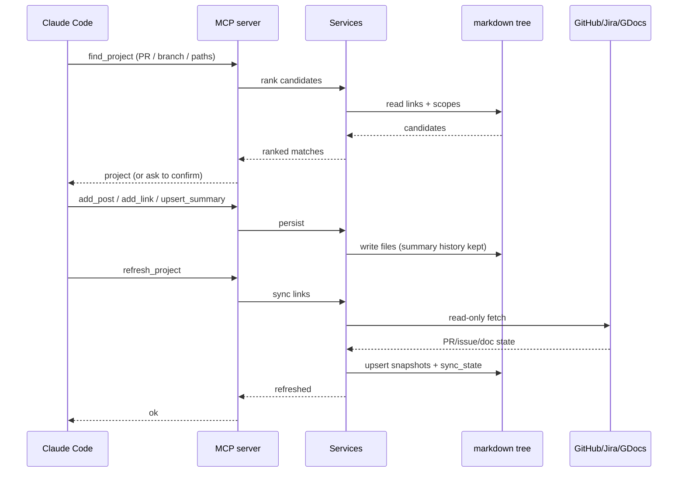

# Architecture

> System design, components, and data flow for Workboard.

## Overview

Workboard is a TypeScript monorepo (npm workspaces) built around a tree of
markdown files. A Next.js App Router app renders the dashboard with server
components and server actions; a Model Context Protocol server exposes the same
domain to coding agents over streamable HTTP and stdio. Both processes read and
write the same directory. Integration clients (GitHub, Jira, Google Docs) sync
external state read-only into a JSON cache; the app and agents only ever read
that cached state. Workboard holds no LLM API key — all AI-authored content
arrives through MCP tool calls.

## Diagram



## Components

| Component | Responsibility | Location |
|-----------|---------------|----------|
| Domain | Entity shapes + enums, storage-independent | `packages/core/src/domain.ts` |
| Board lanes | Derives a task's column and moves it between them | `packages/core/src/services.ts` (`taskLane` / `setTaskLane`) |
| Store | Tree layout, frontmatter, atomic writes, id allocation, locks | `packages/core/src/store/` |
| Services | Domain operations (projects, tasks, posts, comments, summaries, links, warnings, reports) | `packages/core/src/services.ts` |
| Integration clients | GitHub / Jira / Google Docs read-only fetchers | `packages/core/src/integrations/{github,jira,gdrive}.ts` |
| Sync engine | Refreshes links into snapshots, records sync health | `packages/core/src/integrations/sync.ts` |
| MCP server | Tool surface over streamable HTTP + stdio | `packages/mcp/src/{http,stdio,server,tools}.ts` |
| Web app | Dashboard, project pages, reports | `apps/web/app`, `apps/web/components` |
| Server actions | Mutations from the UI | `apps/web/lib/actions.ts` |
| Skills | Claude Code skills that drive the MCP tools | `skills/` |

## MCP tool surface

The agent-facing API, defined in `packages/mcp/src/tools.ts`:

`list_projects` · `get_project` · `find_project` · `create_project` ·
`update_project` · `add_post` · `add_task` · `update_task` ·
`list_queued_tasks` · `claim_task` · `add_task_comment` ·
`list_task_comments` · `add_link` ·
`upsert_summary` · `raise_warning` · `resolve_warning` · `get_activity` ·
`save_report` · `list_reports` · `refresh_project` ·
`ask_question` · `add_comment` · `list_answers` · `list_open_questions`

## Request Flow

An agent finishing a session posts progress and refreshes the summary:



## Key Decisions

- **App writes no AI content** — Workboard has no LLM key; all summaries,
  digests, and triage come from agents via MCP. Keeps model choice and cost with
  the agent, and the app deployable anywhere.
- **Projects ≠ repos** — a monorepo hosts many projects, so a repo link never
  identifies a project. Links are individual PRs/issues or scoped repo slices
  (labels / path prefixes / branch prefix); `find_project` ranks candidates.
- **External systems stay authoritative** — integrations are strictly read-only
  and cached in `snapshots`; the UI degrades to plain links without credentials.
- **The PR view is read live, not synced** — "my open PRs" is a property of the
  token, not of any project, so it has nowhere to live in a board keyed by
  project. `/prs` asks GitHub directly (search, then each PR in full for CI and
  reviews) behind a short in-process cache, and the sidebar badge reads the same
  loader so the count and the page cannot disagree. Project attribution runs the
  other way: a PR is matched back to a project through its links, and stays
  unattributed when two projects in one monorepo both fit.
- **Filters live in the URL, and are remembered in a cookie** — every filter
  combination stays linkable, while the board returns to the last set you chose.
  A cookie rather than localStorage because the board renders on the server:
  the remembered set is known before the HTML is built, so nothing flashes
  unfiltered first. An empty query string means "restore", so clearing the last
  filter says so explicitly with `?filters=none`.
- **Resizable chrome rides a CSS variable, not React state** — the sidebar and
  the detail panel are sized by `--wb-sidebar-w` / `--wb-panel-w` on `<html>`,
  which the pre-paint script stamps from `localStorage` alongside the theme. The
  board renders on the server, so a width restored after mount would shift the
  whole page on the first frame; stamping it before paint means the shell is
  already the right size. Dragging writes the custom property directly, so a
  drag repaints CSS rather than re-rendering the sidebar tree, and only the
  handle itself carries React state (for `aria-valuenow`). Widths are re-clamped
  against the viewport on resize, so one saved on a wide monitor cannot leave a
  narrow window with no room for the page.

- **Contrast is a policy, not a per-colour judgement call** — the neutral
  reading ramp (`ink`, `ink-2`, `muted`) clears WCAG AAA (7:1); semantic and
  brand colour clears AA (4.5:1) as a hard floor. Both are measured against the
  *lightest* surface a tone actually sits on, not just the page, because the
  same token lands on `surface` and `surface-2`. The split is deliberate: AAA on
  prose costs nothing, while AAA on the brand hues would force the accent from
  `#5b66ca` to a muddy `#434b95` for text that is only ever short labels. The
  dark palette treats accent as a *light* hue, so filled accent surfaces take
  their foreground from `--wb-on-accent` (white in light, ink in dark) — white
  on the dark-mode accent is 2.82:1. `scripts/`-adjacent tooling is not needed
  to check this: walk the rendered DOM and compare each text node against its
  composited background.

- **Visible sync health** — every attempt is recorded per link in `sync_state`;
  a dashboard banner surfaces failing or stale syncs, and GitHub rate limits
  trigger a cooldown rather than hammering the API.
- **Soft deletes + summary history** — deleted tasks/links move to a `.deleted/`
  directory and can be restored; every `upsert_summary` is kept so the story's
  evolution is visible.
- **The board is markdown you can read without the app** — one file per entity,
  frontmatter plus prose. The cost is that transactions, joins, and a race-safe
  `UPDATE ... WHERE` are no longer free; see Concurrency below for what replaces
  them. No native module is left anywhere: an old SQLite board is read through
  Node's built-in `node:sqlite`.
- **A lane is derived, never stored** — the board's five columns are a view over
  `status`, `agentReady`, and the claim marker, so the column a card sits in and
  the queue an agent pulls from cannot disagree. `blocked` is the one lane that
  needed a new status: work an agent picked up and could not finish keeps its
  claimer for attribution while dropping out of the queue.
- **Task replies live outside the tasks directory** — a task is one flat file
  named `<id>-<slug>.md` and lookups match on that `<id>-` prefix, so a comments
  directory beside it would be read as the task. `task-comments/<taskId>/` keeps
  the thread hand-browsable without colliding.
- **Questions are distinct from warnings** — a warning reports something broken;
  a question asks for a decision and blocks the asking agent until answered.
  Answers travel back through `list_answers`.

## Data Model

The tree under `data/workboard/` (override with `WORKBOARD_DATA_DIR`). Every
entity is one markdown file: frontmatter holds the fields as `key: value` with
JSON-encoded values, and the body holds the one long field — a project's
description, a task's spec, a post's document.

```
data/workboard/
  projects/<slug>/
    project.md                  # fields in frontmatter, description in the body
    posts/<id>/
      post.md                   # title, type, author; body is the document
      comments/<id>.md          # the reply thread
    tasks/<id>-<slug>.md        # body is the spec an agent works from
    tasks/.claims/<id>          # claim marker — see Concurrency
    tasks/.deleted/…            # soft-deleted, restorable
    task-comments/<taskId>/<id>.md  # the reply thread on a task
    summaries/<stamp>-<id>.md   # every upsert kept, newest wins
    links/<id>.md · links/.deleted/…
    warnings/<id>.md
  reports/<stamp>-<kind>-<id>.md   # cross-project digest / triage / accomplishments
  .cache/                          # derived, safe to delete
    snapshots/<linkId>.json        # last fetched external state
    sync-state/<linkId>.json       # outcome of the last sync attempt
  .seq/<entity>/<n>                # id ledger
```

Ids are integers and globally unique per entity type, so a post or task is
addressable by id alone. The slug in a filename is for hand-browsing only and
may go stale after a rename; lookups match the `<id>-` prefix.

External state lives under `.cache/` as JSON rather than markdown: it is a
ten-minute cache of GitHub/Jira/Docs, not prose, and rebuilding it is one sync.

## Concurrency

The web and MCP servers are separate processes writing one tree, so the store
(`packages/core/src/store/atomic.ts`) leans on two POSIX guarantees:

| Need | Mechanism |
|------|-----------|
| A reader never sees a half-written file | Write a temp file, `fsync`, `rename` — atomic within a filesystem |
| Two agents never claim one task | `open(claim, "wx")` — `O_CREAT\|O_EXCL` succeeds for exactly one caller |
| Two writers never get the same id | Same exclusive create against `.seq/<entity>/<n>`, retrying upward |
| Two creators never take one slug | `mkdir` without `recursive` fails with `EEXIST` |
| Concurrent edits to one file don't lose each other | A `<file>.lock`, broken after 10s so a crashed writer can't wedge the board |

The claim marker is why the pull queue is still exactly-once: claiming creates a
file rather than mutating one, so the winner is decided by the kernel. The lock
narrows the read-modify-write window but does not close it — two processes
editing the same project in the same instant can still lose an edit, which is the
real cost of dropping the database.

Reads walk the whole tree per request. `openStore()` returns a fresh handle that
memoizes for one request and is then discarded, because a second process writes
the same files and any longer-lived cache would serve stale data. At tens of
projects this is well under a millisecond; past a couple of thousand posts it
wants an mtime-keyed cache.

## External Dependencies

| Service | Purpose | Failure mode |
|---------|---------|--------------|
| GitHub API | PR/review/CI state, scoped PR discovery | Sync recorded as failed; last snapshot shown; rate-limit cooldown until reset |
| Jira Cloud | Issue status, per-epic/project counts | Sync recorded as failed; UI falls back to plain links |
| Google Docs | Doc titles + last-edited times | Sync recorded as failed; UI falls back to plain links |
