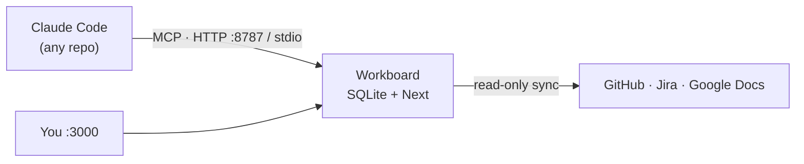

# Workboard

> An AI-native dashboard for all your work — coding and everything else — with an MCP server that lets coding agents keep it up to date.

## Overview

Workboard puts coding projects and non-code work (hiring, process, docs) on one
board. It is the source of truth for *projects*; GitHub, Jira, and Google Docs
stay the source of truth for their own items, which Workboard reads and displays
live.

**The AI content is written by agents, not by the app.** Workboard holds no LLM
API key. Coding agents (Claude Code) connect through Workboard's MCP server to
read project context, post progress updates, and write the summaries, digests,
and triage reports the dashboard displays — guided by the skills in this repo.



## Features

- **Agent-authored updates** — progress notes, summaries, digests, and triage
  reports posted over MCP; the app never calls an LLM.
- **Agent task queue** — queue tasks from the board; any agent session claims
  work over MCP (`list_queued_tasks` / `claim_task`) with atomic claims and
  attribution.
- **Live read-only sync** — PR/review/CI state, Jira issue status, Google Doc
  titles and last-edited times, all degrading gracefully without credentials.
- **Monorepo-aware** — projects ≠ repos; link individual PRs/issues or give a
  repo link a scope (labels, path prefixes, branch prefix) for auto-discovery.
- **Agent warnings** — agents flag things they can't fix with a severity and a
  suggested action, surfaced on the project card and page.
- **Focus over noise** — pin the projects you care about, demote done ones,
  archive the rest; per-project progress metrics and accomplishments reports
  for your own reporting.
- **Trustworthy data** — visible sync health, soft deletes with restore, and
  full summary history.

## Tech Stack

- TypeScript, Node 22, npm workspaces
- Next.js (App Router — server components + server actions)
- SQLite via Drizzle ORM
- Model Context Protocol server (streamable HTTP + stdio)
- Docker / Docker Compose

## Project Structure

```
workboard/
├── packages/core   # schema (SQLite/Drizzle), services, integration clients, sync engine
├── packages/mcp    # MCP server — streamable HTTP (:8787/mcp) + stdio
├── apps/web        # Next.js dashboard (server components + server actions)
├── skills/         # Claude Code skills (status, digest, triage, accomplishments)
├── scripts/        # seed, google-auth, install-skills, mcp-smoke
├── docs/           # documentation
├── data/           # workboard.db (created on first run; gitignored)
├── Dockerfile      # multi-stage image used by both compose services
└── docker-compose.yml  # web + mcp services sharing the `data` volume
```

## Getting Started

### Prerequisites

- Node 22+
- Docker (optional — for the container deployment)

### Setup

```bash
git clone git@github.com:bensuskins/workboard.git
cd workboard
npm install
npm run seed        # optional: sample data
npm run dev         # web on :3000, MCP server on :8787
```

Verify: visit `http://localhost:3000` — you should see the Workboard dashboard.

## Environment Variables

Every integration is optional; the UI degrades to plain links without
credentials. Copy `.env.example` to `.env` and fill in what you use.

| Variable | Required | Default | Description |
|----------|----------|---------|-------------|
| `GITHUB_TOKEN` | no | — | Live PR state, review status, CI checks on in-flight PRs; monorepo-scoped PR discovery |
| `JIRA_BASE_URL`, `JIRA_EMAIL`, `JIRA_API_TOKEN` | no | — | Jira Cloud issue status and per-epic/project counts |
| `GOOGLE_CLIENT_ID`, `GOOGLE_CLIENT_SECRET` | no | — | Google Doc titles + last-edited times (run `npm run google:auth` once) |
| `WORKBOARD_MCP_TOKEN` | no | — | Require a bearer token on the HTTP MCP transport |

## Commands

| Command | Purpose |
|---------|---------|
| `npm run dev` | Run web (:3000) and MCP (:8787) locally |
| `npm run build` | Typecheck + build all workspaces |
| `npm run seed` | Load sample data |
| `npm test` | Core unit tests (vitest) |
| `npm run mcp:smoke` | Full agent flow against the real MCP server (stdio) |
| `npm run google:auth` | One-time Google Docs OAuth flow |
| `npm run skills:install` | Copy `skills/` → `~/.claude/skills/` |

## Connecting a coding agent

From any repo where an agent works:

```bash
claude mcp add --transport http workboard http://localhost:8787/mcp
```

(Or stdio: `claude mcp add workboard -- npx --prefix /path/to/workboard workboard-mcp`.)
Then install the skills so agents know *how* to use it:

```bash
npm run skills:install
```

| Skill | What it does |
|-------|--------------|
| `/workboard-status` | End-of-session: resolve the project, post what was done, link new PRs, refresh the AI summary. At session start, also check the agent queue and claim queued tasks. |
| `/workboard-digest` | Cross-project "where everything stands" briefing, saved to the Reports page |
| `/workboard-triage` | Find stale projects, blockers, rotting PRs, overdue tasks; save a prioritized action list |
| `/workboard-accomplishments` | "What shipped" recap of your work plus agent deliveries — for standups and reviews |

Schedule digests however you run Claude — e.g. a cron entry like
`0 8 * * 1-5 claude -p "/workboard-digest"`, or a Claude Code Routine.

### Tell your agent about Workboard

Once the MCP server is connected and the skills are installed, drop this into
your global `~/.claude/CLAUDE.md` (or a repo's `CLAUDE.md`) so agents know
Workboard exists and keep it current without being asked:

```markdown
## Workboard

This machine runs **Workboard**, an AI-native project dashboard, reachable over
its MCP server (server name: `workboard`). Workboard is the source of truth for
*projects*; use it to keep work status current.

- At the **end of a working session**, run `/workboard-status` to resolve the
  current project, post what you did, link any new PRs, and refresh the summary.
- Before starting, you may call the `find_project` / `get_project` MCP tools to
  load existing context for the repo you're in.
- At **session start**, check `list_queued_tasks` for the project you're working
  in. If a task is queued and you take it on, `claim_task` it first (this marks
  it in_progress under your name), then `update_task` to done when finished.
- If you hit something you can't fix (blocked, needs a human, external outage),
  raise it with the `raise_warning` MCP tool instead of silently moving on.
- Do **not** create a new project for work that already maps to an existing one
  — search first with `find_project`.
```

Trim it to taste — the key parts are naming the `workboard` MCP server and
pointing at `/workboard-status` so updates happen automatically.

## Testing

```bash
npm test            # core unit tests (vitest)
npm run mcp:smoke   # full agent flow against the real MCP server (stdio)
```

Core services are covered by contract tests against a real in-memory SQLite
database rather than mocks.

## Deployment

```bash
cp .env.example .env          # fill in integration credentials (all optional)
docker compose up -d --build  # web on :3000, MCP on :8787
docker compose run --rm web npm run seed   # optional: sample data
```

One image, two services (`web` and `mcp`), sharing the SQLite database on the
named `data` volume — that volume is the only state worth backing up. See
[TROUBLESHOOTING.md](TROUBLESHOOTING.md) for Docker MCP access, Google auth, and
backup notes.

## Architecture

See [ARCHITECTURE.md](ARCHITECTURE.md) for system design, the MCP tool surface,
sync engine, and data model.

## Troubleshooting

See [TROUBLESHOOTING.md](TROUBLESHOOTING.md) for common issues and fixes.

## Security

See [SECURITY.md](SECURITY.md) for vulnerability reporting.

## License

[MIT](../LICENSE)
